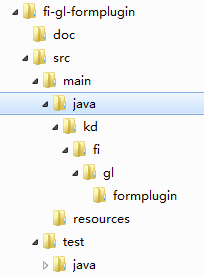

# 1 开发规范

[官方链接]: https://dev.kingdee.com/index/docsNew/717674b6-74ca-49d7-8a9d-ba269737c478

## 1.1 项目命名规范

书写格式： <产品云代号>-<系统代号>-<工程类型>

产品云代号： 产品的开发代号（例如：bos、fi、hr）

系统代号： 按系统[技术框架 | 应用编码]划分代号（ksql、gl、ep、sal）

云代号：

- 金蝶BOS：Kingdee Business Operating System （金蝶业务操作系统）
  fi: finance 财务
  hr: Human Resource 人力资源
  ksql: 金蝶产品实现多数据库支持非常重要的基础引擎
  gl: General Ledger 总账
  ap: Account Payable 应付

工程类型（9类）：

- 表单插件工程(formplugin)：用于表单插件；（包括：对话框、单据、基础资料、列表、移动单据、移动列表插件）
- 操作插件工程(opplugin)：用于操作插件；
- 报表工程(report)：用于帐表功能开发；
- 微服务接口工程(mservice-api)：业务微服务接口；
- 微服务实现工程(mservice)：业务微服务实现；
  如：bos-ksql，bos-designer-plugin
- 业务工程(business)：用于业务功能封装，供插件、报表、微服务工程调用；
- 公共项目工程(common)：公共方法、常量类，不应该依赖其他工程；
- webapi工程(webapi)：API接口；
- BOS功能扩展工程（ext）；
  如：bos-ksql，fi-gl-formplugin，fi-gl-opplugin，fi-gl-report，
  fi-gl-mservice-api，fi-gl-mservice，fi-gl-business

## 1.2 服务项目命名规范

书写格式： mservice[-产品云代号]-<服务名称>[-子功能名称]

产品云代号： 产品的开发代号（例如：fi、hr）,bos产品代号可省略

如：mservice-metadata，mservice-fin-ep

## 1.3 包命名规范

书写格式： kd.<产品云代号>[.应用编码] [.功能] [.后缀]

产品云代号： 产品的开发代号（例如：bos、fi、hr）

功能：模块的功能名，可以增加子功能 [.子功能]

后缀：.{test | plugin }

包名小写，如：

- 异常框架包命名：kd.bos.exception
- 缓存测试包命名：kd.bos.cache.test
- 微服务包命名：
  kd.bos.mservice.{服务名}
  kd.fin.mservice. .{服务名}
- 插件包命名：kd.fi.gl.formplugin
- 财务总账包命名：kd.fi.gl.voucher
- 测试包命名：kd.fi.gl.voucher.test

## 1.4 目录结构

一级目录：工程目录（bos-cache）

二级目录：src，doc

三级目录：main，test

四级目录：java，resource

四级目录以下按包路径目录

## 1.5 插件类名

- 表单插件：{插件名}Plugin 如：MainPagePlugin
- 单据插件：{插件名}Edit 如：PurchaserEdit
- 列表插件：{插件名}List 如：PurchaserList
- 操作插件：{插件名}Op 如：PurchaserOp
- 报表插件：{插件名}Rpt 如：PurchaserRpt

## 1.6 插件继承关系

| 类（插件、服务） | 继承自抽象类          |
| :--------------- | :-------------------- |
| BOS插件          | 单据插件              |
| 基础资料插件     | AbstractBasePlugIn    |
| 动态表单插件     | AbstractFormPlugIn    |
| 列表插件         | AbstractListPlugIn    |
| 移动单据插件     | AbstractMobBillPlugin |
| 移动列表插件     | AbstractMobListPlugIn |
| 扩展业务服务     | 单据操作              |
| 动态表单操作     | AbstractFormOperation |